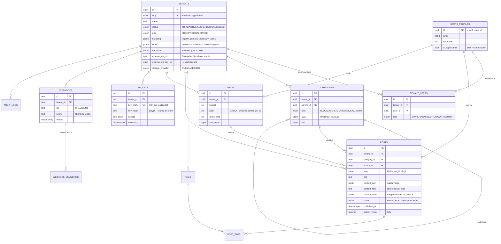

# Kontorōru CMS — Arquitectura Técnica

> CMS Headless Multi-tenant · Producto SaaS de **Rukma Studio**
> Stack: Next.js (App Router) · Tailwind CSS · Shadcn/UI · Supabase (Postgres + RLS + Auth + Storage)

---

## 0. Principios de diseño

| Principio | Implicación concreta |
|---|---|
| **El aislamiento vive en la base de datos, no en la app** | RLS `FORCE` en todas las tablas. Un bug en un `where` no filtra datos entre clientes. |
| **Rukma Studio controla el código; el cliente, su contenido** | Un solo despliegue, una sola migración. El cliente sólo edita `branding`, contenido y webhooks. |
| **El contenido es un dato, no una plantilla** | Sin themes PHP ni plugins ejecutables (a diferencia de WordPress). La superficie de ataque es la API. |
| **Todo lo que pueda cambiar de proveedor, va tras una interfaz** | Storage con Adapter Pattern → Supabase → S3/R2 sin tocar el editor. |
| **Nada bloqueante en la ruta de escritura** | Los webhooks se encolan (outbox), no se envían dentro del `UPDATE`. |

---

## 1. Modelo de datos (ERD)



> Nota: `POST_TAGS`, `WEBHOOK_DELIVERIES` y `AUDIT_LOGS` son adiciones al listado
> original — respectivamente: etiquetas N:M, cola de entrega con reintentos, y
> trazabilidad para soporte/compliance.

**Migraciones ejecutables:**

| Archivo | Contenido |
|---|---|
| `supabase/migrations/20260803000100_init_schema.sql` | Enums, tablas, índices, triggers de integridad |
| `supabase/migrations/20260803000200_rls_policies.sql` | Helpers + políticas RLS + políticas de Storage |
| `supabase/migrations/20260803000300_api_and_webhooks.sql` | API keys (hash/verificación), outbox de webhooks, uso/límites |
| `supabase/migrations/20260803000400_webhook_backoff.sql` | `next_attempt_at` + índice parcial para el backoff de entregas |
| `supabase/migrations/20260803000500_delivery_retry.sql` | Política de reintento manual + trigger que impide falsear el resultado |
| `supabase/migrations/20260803000600_platform_overview.sql` | Vista `platform_tenant_overview` con uso agregado (`security_invoker`) |
| `supabase/migrations/20260803000700_rate_limit.sql` | Contador de cupos (tabla UNLOGGED + UPSERT atómico) y plan en `resolve_api_key` |
| `supabase/migrations/20260803000800_soft_delete_events.sql` | Eventos de papelera y `previousSlug` al cambiar la URL |
| `supabase/migrations/20260803000900_post_revisions.sql` | Historial de versiones por trigger, con retención y sólo lectura |
| `supabase/migrations/20260803001000_i18n.sql` | Multi-idioma por grupo de traducción, con sus invariantes en triggers |

---

## 2. Estrategia Multi-tenant

### 2.1 Modelo principal — Shared DB + RLS

Una base, una fila `tenant_id` en cada tabla, RLS `ENABLE` + **`FORCE`**
(el `FORCE` es lo que impide que el propio dueño de la tabla se salte las políticas).

**Las tres funciones que sostienen todo:**

```sql
public.is_superadmin()                    -- staff de Rukma Studio
public.user_tenant_ids() → uuid[]         -- tenants del usuario actual
public.has_tenant_role(tenant, roles[])   -- RBAC granular
```

Son `STABLE SECURITY DEFINER`, lo que da dos propiedades críticas:

1. **No hay recursión**: consultan `tenant_users` saltándose las políticas de esa misma tabla.
2. **Rendimiento**: envueltas en `(select fn())`, Postgres las evalúa como *InitPlan* — **una vez por query**, no una por fila. Sin ese `select`, una tabla de 50k posts hace 50k llamadas.

### 2.2 Matriz de permisos

| Acción | SuperAdmin | Owner | Admin | Editor | Contributor |
|---|:--:|:--:|:--:|:--:|:--:|
| Alta/baja de tenants, límites, plan | ✅ | ❌ | ❌ | ❌ | ❌ |
| Branding (logo, colores) | ✅ | ✅ | ✅ | ❌ | ❌ |
| Invitar / expulsar colaboradores | ✅ | ✅ | ✅ | ❌ | ❌ |
| API Keys y Webhooks | ✅ | ✅ | ✅ | ❌ | ❌ |
| Crear / editar cualquier post | ✅ | ✅ | ✅ | ✅ | ❌ |
| Publicar / archivar | ✅ | ✅ | ✅ | ✅ | ❌ |
| Crear y editar **sus** borradores | ✅ | ✅ | ✅ | ✅ | ✅ |
| Borrar posts | ✅ | ✅ | ✅ | ❌ | ❌ |

Las columnas reservadas a Rukma Studio (`plan`, `status`, `limits`, `db_mode`, `slug`…)
se protegen con un **trigger `BEFORE UPDATE`**, no con RLS: RLS decide *si* puedes
actualizar la fila, el trigger decide *qué columnas*. Sin él, un Client Admin podría
auto-asignarse el plan Enterprise con un `PATCH` directo a PostgREST.

### 2.3 Extensibilidad — Enterprise con BD dedicada

`tenants.db_mode = 'DEDICATED'` + `external_db_url` + `external_db_key_ref` (→ Supabase Vault).
`createTenantClient()` en [server.ts](src/lib/supabase/server.ts) resuelve el cliente correcto
en runtime. El resto de la aplicación **no cambia**: mismo esquema, mismas queries.

> Las migraciones se aplican a los tenants dedicados con el mismo `supabase db push`
> apuntado a su proyecto — de ahí que el esquema deba mantenerse idéntico.

### 2.4 Storage

Un único bucket `tenant-media`, aislado **por prefijo de ruta**: `<tenant_id>/2026/08/<uuid>.webp`.

Un bucket por tenant sería lo intuitivo, pero no escala: Supabase limita el número de
buckets, y cada uno exigiría sus propias políticas. El prefijo escala a miles de clientes,
y sobrevive intacto a la migración a S3/R2. Triple defensa:

1. Política RLS sobre `storage.objects` (`foldername(name)[1] = ANY(user_tenant_ids())`).
2. `CHECK` constraint en `media.path`.
3. `buildObjectPath()` en el adapter — nunca usa el nombre de archivo original.

#### Migración a S3 o R2

`S3StorageAdapter` cubre ambos: R2 habla el protocolo S3 y sólo cambia el
endpoint. Las credenciales son globales (env); el destino es por tenant
(`tenants.storage_provider` y `storage_bucket`).

**La clave de que la migración no tenga ventana de corte es que el proveedor
se guarda por archivo, no por tenant.** `media.provider` recuerda dónde acabó
cada uno: al cambiar el destino de un cliente, lo nuevo va al bucket externo y
lo viejo se sigue sirviendo desde Supabase. `signLocations()` agrupa por
proveedor y firma cada grupo con su adapter, así que una misma pantalla —o una
misma respuesta de la API— puede mezclar ambos orígenes sin que el llamante lo
sepa.

Sin ese matiz, activar S3 en un cliente rompería todas sus imágenes anteriores.

---

## 3. Estructura de código (Next.js App Router)

```
kontororu-cms/
├── src/
│   ├── app/
│   │   ├── (marketing)/                 # Landing pública de Rukma Studio
│   │   │   ├── page.tsx
│   │   │   └── pricing/page.tsx
│   │   │
│   │   ├── (auth)/                      # Sin chrome de dashboard
│   │   │   ├── login/page.tsx
│   │   │   ├── invite/[token]/page.tsx
│   │   │   └── callback/route.ts
│   │   │
│   │   ├── (platform)/                  # ── SuperAdmin · Rukma Studio ──
│   │   │   └── admin/
│   │   │       ├── layout.tsx           # guard: is_superadmin()
│   │   │       ├── tenants/
│   │   │       │   ├── page.tsx         # listado + estado del servicio
│   │   │       │   └── [tenantId]/
│   │   │       │       ├── page.tsx     # límites, plan, uso
│   │   │       │       └── impersonate/route.ts
│   │   │       ├── feature-flags/page.tsx
│   │   │       └── audit/page.tsx
│   │   │
│   │   ├── (dashboard)/                 # ── Cliente ──
│   │   │   └── [tenantSlug]/
│   │   │       ├── layout.tsx           # ← resuelve tenant + <TenantTheme>
│   │   │       ├── page.tsx             # overview
│   │   │       ├── content/
│   │   │       │   ├── page.tsx         # tabla de posts (filtros, estados)
│   │   │       │   ├── new/page.tsx
│   │   │       │   └── [postId]/
│   │   │       │       ├── page.tsx     # editor Tiptap
│   │   │       │       └── actions.ts   # Server Actions: save/publish/archive
│   │   │       ├── categories/page.tsx
│   │   │       ├── media/page.tsx
│   │   │       ├── team/page.tsx        # ADMIN+
│   │   │       ├── branding/page.tsx
│   │   │       ├── locales/page.tsx
│   │   │       ├── addons/page.tsx
│   │   │       ├── profile/page.tsx
│   │   │       ├── api-keys/page.tsx
│   │   │       └── webhooks/page.tsx
│   │   │
│   │   └── api/
│   │       ├── v1/                      # ── API Headless pública ──
│   │       │   ├── posts/route.ts
│   │       │   ├── posts/[slug]/route.ts
│   │       │   ├── categories/route.ts
│   │       │   └── graphql/route.ts     # Fase 3
│   │       ├── media/upload/route.ts
│   │       └── internal/
│   │           └── webhooks/dispatch/route.ts   # worker periódico (red de seguridad del cron)
│   │
│   ├── components/
│   │   ├── ui/                          # Shadcn — NO editar a mano
│   │   ├── editor/                      # Tiptap
│   │   │   ├── tiptap-editor.tsx
│   │   │   ├── editor-toolbar.tsx
│   │   │   ├── extensions.ts
│   │   │   └── use-media-upload.ts
│   │   ├── tenant-theme.tsx             # inyección de CSS vars
│   │   └── shared/
│   │
│   ├── lib/
│   │   ├── supabase/
│   │   │   ├── server.ts                # RLS client · service client · tenant client
│   │   │   ├── client.ts                # browser client
│   │   │   ├── middleware.ts            # refresh de sesión
│   │   │   └── types.ts                 # generado: supabase gen types
│   │   ├── theme/
│   │   │   ├── color.ts                 # contraste WCAG, shades
│   │   │   └── branding.ts              # parseo + derivación de tokens
│   │   ├── storage/
│   │   │   ├── adapter.ts               # interfaz + rutas seguras
│   │   │   ├── supabase-adapter.ts
│   │   │   └── s3-adapter.ts            # Fase 3
│   │   ├── api/
│   │   │   ├── authenticate.ts          # API keys
│   │   │   └── serializers.ts
│   │   ├── auth/
│   │   │   ├── tenant-context.ts        # resolver tenant + rol (cache por request)
│   │   │   └── guards.ts                # requireRole()
│   │   └── content/
│   │       ├── tiptap-to-html.ts        # render server-side + sanitizado
│   │       └── slug.ts
│   │
│   ├── middleware.ts                    # sesión + resolución de tenant por slug/dominio
│   └── styles/globals.css               # tokens base del design system
│
├── supabase/
│   ├── migrations/
│   ├── seed.sql
│   └── config.toml
└── docs/ARCHITECTURE.md
```

**Convenciones que sostienen la estructura:**

- El `layout.tsx` del segmento `[tenantSlug]` es **el único** punto donde se resuelve el
  tenant. Todo lo de dentro lo consume vía `tenant-context.ts` (cacheado por request con `cache()`).
- Mutaciones → **Server Actions** colocalizadas (`actions.ts`), no route handlers.
  Las route handlers quedan para la API pública y los webhooks.
- `components/ui/` es territorio de Shadcn: se regenera, no se parchea.

---

## 4. Theming dinámico por tenant

**El problema:** los colores de marca son datos de la BD, distintos por request, y deben
aplicarse **antes del primer pintado** — si no, el cliente ve medio segundo de gris Rukma
antes de su azul corporativo.

**La solución:** CSS Variables inyectadas en un Server Component. Cero JavaScript en el
cliente, cero flash, y la caché de Next sigue funcionando porque el `<style>` viaja en el
HTML del stream.

### Flujo

```
tenants.branding (JSONB)
   → parseBranding()        valida hex + unidades  ← barrera anti-inyección CSS
   → brandingToCssVars()    deriva tokens Shadcn + foreground con contraste WCAG
   → <TenantTheme>          serializa a <style> con scope #tenant-scope
   → Tailwind/Shadcn        bg-primary, ring, --radius… ya resuelven al color del cliente
```

### Uso en el layout

```tsx
// src/app/(dashboard)/[tenantSlug]/layout.tsx
import { parseBranding } from "@/lib/theme/branding";
import { TenantTheme } from "@/components/tenant-theme";
import { getTenantBySlug } from "@/lib/auth/tenant-context";

export default async function TenantLayout({
  params, children,
}: { params: Promise<{ tenantSlug: string }>; children: React.ReactNode }) {
  const { tenantSlug } = await params;
  const tenant = await getTenantBySlug(tenantSlug);   // 404 si no hay membresía

  return (
    <TenantTheme branding={parseBranding(tenant.branding)}>
      <DashboardShell tenant={tenant}>{children}</DashboardShell>
    </TenantTheme>
  );
}
```

### Decisiones que importan

- **Sólo se sobreescriben tokens de marca.** Neutrales, tipografía, sombras y espaciado
  son de Rukma Studio. El cliente personaliza *su marca*, no *el producto* — así una
  actualización de UI llega igual a todos sin romper nada.
- **El foreground se calcula, no se elige.** `readableForeground()` compara el ratio de
  contraste WCAG contra blanco y negro y gana el mayor. Un cliente puede subir amarillo
  flúor: el texto seguirá siendo legible.
- **`parseBranding()` es una frontera de seguridad.** El JSONB es entrada de usuario;
  sin validación por regex, `"primary": "red;} body{display:none"` sería inyección CSS
  al serializar. Por eso el `dangerouslySetInnerHTML` de `TenantTheme` es seguro:
  todo valor que llega ya pasó por el validador.
- **Modo oscuro derivado.** Los mismos dos colores producen una paleta oscura con
  `shade()`, sin pedirle al cliente una segunda paleta que no sabría elegir.

### Previsualización en vivo (pantalla de branding)

En `branding` el usuario debe ver el cambio *mientras* mueve el color picker.
Ahí sí se usa un `useEffect` que escribe sobre `document.getElementById("tenant-scope").style`,
y al guardar se persiste el JSONB — el server-render toma el relevo en la siguiente navegación.

---

## 5. Editor Tiptap + Supabase Storage

Archivos: [`src/components/editor/`](src/components/editor/) · [`api/media/upload/route.ts`](src/app/api/media/upload/route.ts)

### Dependencias

```bash
npm i @tiptap/react @tiptap/pm @tiptap/starter-kit @tiptap/extension-image @tiptap/extension-link @tiptap/extension-placeholder @tiptap/extension-youtube @tiptap/extension-code-block-lowlight lowlight
```

### Capacidades

| Bloque | Extensión |
|---|---|
| Texto, títulos, listas, citas | `StarterKit` |
| Bloques de código con resaltado | `CodeBlockLowlight` + `lowlight` |
| Imágenes (upload directo) | `Image` + `useMediaUpload` |
| Vídeo | `Youtube` (nocookie) |
| Callouts (info/warn/success/danger) | Nodo custom `Callout` |
| Enlaces | `Link` (`rel="noopener noreferrer nofollow"`) |

### Salida dual

Cada guardado persiste **`content_json`** (fuente de verdad, re-editable) y
**`content_html`** (renderizado en servidor con `generateHTML()` + sanitizado).
El front-end del cliente elige: quien quiera control total del render consume el JSON;
quien quiera velocidad, inyecta el HTML. Renderizar el HTML en el momento de guardar
—y no en cada lectura de la API— convierte un coste por-request en un coste por-publicación.

### Camino de una imagen

```
paste / drop / botón
  → objectURL local insertado ya en el documento     (feedback inmediato)
  → POST /api/media/upload                           (multipart)
       ├── auth.getUser()                            401 si no hay sesión
       ├── membresía en tenant_users vía RLS         403 — el tenantId del body NO se cree
       ├── MIME allowlist + límite de 25 MB          415 / 413
       ├── cuota del plan vía tenant_usage()         507
       ├── storage.put() → <tenant>/2026/08/<uuid>   nunca el nombre original
       ├── INSERT en media                           rollback del objeto si falla
       └── signed URL (7 días)
  → replaceImageSrc() sustituye el objectURL por la URL final
```

`allowBase64: false` es deliberado: sin él, un pegado desde Word mete imágenes como
data-URI de megabytes dentro del JSONB, y la tabla `posts` engorda sin control.

---

## 6. API Headless y Webhooks

### Autenticación

```
Authorization: Bearer kntr_live_<prefix12>.<secret48>
```

Se almacena `key_prefix` (lookup indexado) + `key_hash` (bcrypt). La clave en claro
se muestra **una sola vez**, al crearla. **El `tenant_id` se deriva de la clave, nunca
del request** — es lo que impide que un consumidor cambie un query param y lea otro cliente.

### Endpoints (Fase 1–2)

| Método | Ruta | Estado |
|---|---|---|
| GET | `/api/v1/posts` | ✅ listado, filtros y paginación por cursor |
| GET | `/api/v1/posts/[slug]` | ✅ detalle con cuerpo (html + json) |
| GET | `/api/v1/categories` | ✅ con conteo de publicadas |
| GET | `/api/v1/media` | ✅ biblioteca paginada (`media:read`) |
| GET | `/api/v1/media/[id]` | ✅ archivo con firma fresca (`media:read`) |
| POST | `/api/v1/posts` | Fase 3 (`content:write`) |

Contrato completo para clientes: **[API.md](API.md)**.

GraphQL (Fase 3) se expone en `/api/v1/graphql` sobre el mismo `authenticate.ts`.

### Webhooks — outbox pattern

```
UPDATE posts SET status='PUBLISHED'
   → trigger posts_enqueue_events        INSERT en webhook_deliveries  (no hace HTTP)
   → dos disparadores sobre el MISMO worker (`lib/content/webhook-dispatch.ts`):
       a) la propia Server Action, en `after()` → entrega en segundos
       b) GitHub Actions · webhooks-cron.yml (cada 5 min, **GET**) → /api/internal/webhooks/dispatch
   → POST firmado al endpoint del cliente
   → backoff exponencial: 1m 2m 4m 8m 16m 32m, 6 intentos
     (`webhook_deliveries.next_attempt_at`; el worker sólo pide lo vencido)
```

**El camino normal es (a).** Publicar dispara el drenado del propio espacio en
`after()`, así que la web del cliente se entera en el mismo segundo. Con sólo el
cron, el editor pulsaba Publicar y su web tardaba hasta cinco minutos en
cambiar — y como los cron de Actions se ejecutan cuando hay hueco, a veces más.
Esa espera se leía desde fuera como "el CMS no ha guardado".

Va en `after()` y no en la transacción por lo mismo que el trigger no hace
HTTP: la web caída de un cliente no puede hacer que Publicar falle ni que se
quede colgado. `dispatchNow` se traga el error y lo registra; la entrega
sobrevive en la cola.

**(b) sigue siendo imprescindible**, ahora como red de seguridad: es lo único
que ejecuta los reintentos con backoff, lo encolado mientras la app estaba
caída, y las entregas de un drenado inmediato que no llegó a completarse.

El disparador periódico es un workflow de GitHub Actions, no la plataforma de
despliegue: el servicio corre en **Railway**, que no trae cron. Hubo un
`vercel.json` que programaba este mismo endpoint cada minuto, pero ese fichero
sólo lo lee Vercel: confiar en él dejó la cola sin drenar diez días, y por eso
se borró del repo — una configuración que nadie ejecuta sólo sirve para que
alguien la dé por buena.

⚠️ GitHub **desactiva los workflows programados tras 60 días sin actividad en el
repositorio**. Con (a) en su sitio eso ya no congela las publicaciones, pero sí
deja los reintentos sin ejecutar. Si el repo va a estar quieto largas
temporadas, el sustituto es un servicio cron en Railway.

Con dos disparadores hay drenados solapados, así que `deliver()` **reserva** la
fila antes de salir a la red: mueve `next_attempt_at` condicionando el UPDATE al
valor que leyó. El que no encuentra la fila con ese valor se retira y la cuenta
como `deferred`. Sin esa reserva, cron y publicación entregarían el mismo evento
dos veces.

El trigger **no** hace la llamada HTTP. Si lo hiciera (`pg_net`, `http`), la web caída de
un cliente convertiría cada publicación en un timeout de 30 segundos dentro de una
transacción. La cola desacopla la escritura de la entrega.

Cabeceras de firma:

```
X-Kontororu-Event:     post.published
X-Kontororu-Timestamp: 1785312000
X-Kontororu-Signature: sha256=<hmac(secret, "timestamp.body")>
```

El timestamp entra en el HMAC para que el receptor pueda rechazar replays con una
ventana de tolerancia. Verificación en el front-end del cliente (Next.js):

```ts
// app/api/revalidate/route.ts — en la web DEL CLIENTE
import { createHmac, timingSafeEqual } from "node:crypto";
import { revalidateTag } from "next/cache";

export async function POST(req: Request) {
  const body = await req.text();
  const ts = req.headers.get("x-kontororu-timestamp")!;
  const sig = req.headers.get("x-kontororu-signature")!;

  if (Math.abs(Date.now() / 1000 - Number(ts)) > 300) {
    return new Response("stale", { status: 401 });
  }
  const expected = `sha256=${createHmac("sha256", process.env.KONTORORU_WEBHOOK_SECRET!)
    .update(`${ts}.${body}`).digest("hex")}`;
  if (sig.length !== expected.length ||
      !timingSafeEqual(Buffer.from(sig), Buffer.from(expected))) {
    return new Response("bad signature", { status: 401 });
  }

  const { data } = JSON.parse(body);
  revalidateTag(`post:${data.slug}`);
  revalidateTag("posts");
  return Response.json({ revalidated: true });
}
```

---

## 7. Hoja de ruta del MVP

### Fase 1 — Núcleo multi-tenant *(~4–5 semanas)*

**Objetivo: un cliente real publica contenido y su web lo consume.**

- [x] Scaffold Next.js 15 + Tailwind v4 + Shadcn + config de Supabase
- [x] Migraciones `001`–`003` escritas · `seed.sql` con dos tenants
- [x] Middleware: refresh de sesión + guardia de rutas privadas
- [x] Resolución de tenant (`getTenantContext`, memoizado por request)
- [x] Guards de rol + matriz de permisos (`lib/auth/guards.ts`)
- [x] Theming dinámico por tenant, renderizado en servidor
- [x] Dashboard shell con navegación filtrada por permisos
- [x] Editor Tiptap + upload a Storage con cuotas
- [x] `GET /api/v1/posts` con API Keys · outbox de webhooks + worker
- [x] **Suite de aislamiento RLS** (ver [TESTING-RLS.md](TESTING-RLS.md)) — bloqueante
- [x] Login + pantalla de resumen · `next build` en verde
- [ ] Aplicar migraciones contra Supabase local y dejar la suite en verde
- [ ] `npm run db:types` — sustituir el placeholder `Database = any`
- [x] CRUD de posts: lista con filtros y paginación, editor, Server Actions
- [x] Transiciones `DRAFT`/`PUBLISHED`/`ARCHIVED` + borrado
- [x] CRUD de categorías con conteo de uso
- [x] Campos personalizados (`custom_fields`) editables desde el editor
- [x] Render server-side del contenido con sanitizado (DOMPurify)
- [x] Biblioteca de medios: rejilla, texto alternativo, borrado, cuotas
- [x] Dimensiones de imagen leídas de la cabecera (PNG/JPEG/GIF/WebP)
- [x] Equipo: invitaciones por email, cambio de rol, expulsión
- [x] `/switch` + cierre de sesión + callback de invitación
- [x] Tests unitarios de las funciones puras (22 aserciones)
- [x] Pantalla de tenant suspendido (sin redirect, sin bucle)
- [x] Boundaries de UI: error, 404, 403, loading, global-error
- [x] Cron del worker de webhooks (GitHub Actions) + backoff real
- [x] Papelera reversible, archivado y cambio de URL desde el editor
- [ ] Autoguardado con `useOptimistic` en lugar de botón manual
- [x] Pantallas de configuración: marca (con preview en vivo), API keys, webhooks
- [x] Validación anti-SSRF de destinos de webhook, con tests

> **Criterio de salida:** dos tenants seed; el tenant A no ve *ni una fila* del tenant B
> en ninguna tabla, ni por API, ni por PostgREST directo, ni por Storage.

### Fase 2 — Producto vendible *(~3–4 semanas)*

**Objetivo: onboarding self-service y sensación de "es mi CMS".**

- [ ] Branding: subida de logo + color pickers + preview en vivo
- [ ] Gestión de equipo: invitar, cambiar rol, revocar (matriz RBAC completa)
- [x] Panel SuperAdmin: alta de clientes, límites, uso, suspensión, auditoría
- [ ] Webhooks: UI de configuración + worker + log de entregas con reintento manual
- [ ] Etiquetas, campos personalizados (`custom_fields`) con editor de esquema
- [ ] Biblioteca de medios con búsqueda y `alt` obligatorio
- [ ] Callouts, embeds de vídeo, tabla de contenidos automática
- [ ] Panel de SEO por post (`seo` JSONB) + preview de OpenGraph
- [ ] Audit log visible para el Client Admin

> **Criterio de salida:** Rukma Studio da de alta un cliente nuevo en < 10 minutos
> sin tocar SQL.

### Fase 3 — Escala y diferenciación *(~4–6 semanas)*

**Objetivo: retener clientes y abrir el segmento Enterprise.**

- [ ] GraphQL en `/api/v1/graphql`
- [ ] Programación de publicación (`scheduled_for` + cron)
- [x] Versionado de contenido y restauración (`post_revisions`)
- [x] Multi-idioma (`locale` + agrupación por `translation_group_id`)
- [ ] Adapter S3/R2 + CDN propio con transformación de imágenes
- [ ] Facturación (Stripe) ligada a `plan` y `limits`
- [ ] Enterprise: aprovisionamiento de BD dedicada (`db_mode = 'DEDICATED'`)
- [ ] SDK oficial `@rukma/kontororu-client` (TS) + plantillas Next.js/Astro
- [ ] Analítica de contenido y observabilidad (Sentry + Logflare)

**Deuda técnica aceptada en Fase 1, a pagar en Fase 3:** sin versionado de contenido,
sin i18n, y `content_html` regenerado íntegro en cada guardado. Son decisiones
conscientes para llegar antes a un cliente real, no descuidos.

---

## 8. Seguridad — checklist no negociable

- [ ] **Tests de aislamiento RLS en CI.** Por cada tabla: crear dos tenants, autenticarse
      como miembro de A, y afirmar que `select/insert/update/delete` sobre filas de B
      devuelven 0 filas o error. Es el único test que puede bloquear un despliegue.
- [ ] `SUPABASE_SERVICE_ROLE_KEY` sólo en runtime servidor. Un grep en CI que falle si
      aparece en cualquier archivo bajo `components/` o con `"use client"`.
- [ ] Todo `createServiceClient()` va acompañado de un `.eq("tenant_id", …)` explícito.
      Revisión obligatoria en PR: el service role no tiene RLS.
- [ ] `content_html` sanitizado en servidor antes de persistir (el editor no es la frontera).
- [x] Rate limiting por API key en `/api/v1/*`, con cupo según plan.
- [ ] Webhooks: sólo HTTPS (`CHECK` en BD) y bloqueo de rangos IP privados (anti-SSRF).
- [ ] Rotación de API Keys con periodo de gracia; `revoked_at` en lugar de `DELETE`.
- [ ] Impersonación del SuperAdmin siempre registrada en `audit_logs`.
